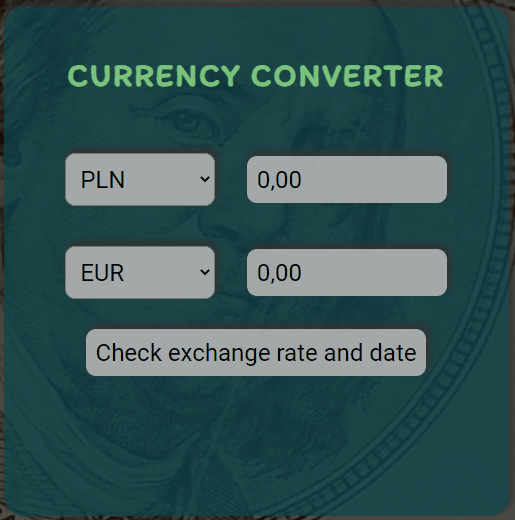

# Simply Currency Converter

This is a simple currency converter that converts the value of a chosen currency to value of another currency. Converter use free Exchange rates API to give You as current rate as it possible.

### Create React App
This project was bootstrapped with [Create React App](https://github.com/facebook/create-react-app).

# Live Demo
https://mateusz24polok.github.io/currency-converter-react-app/

# Instructions how to use
1. Select your currency from list in first line
2. Enter value of currency You want to exchange
3. In second line select currency in which you want to get money
4. By clicking "Check exchange rate and date" button You can check exactly details of exchange conversion

# Technologies
## Technologies used in project:
- React.js
- Styled Components with ThemeProvider and GlobalStyle
- Hooks (included custom hooks)
- CRA (Create-React-App)
- Semantic HTML
- CSS with Flexbox
- JavaScript (ES6+)
- GoogleFonts
- AJAX
- Fetch API
- Promises
- GitHub Pages

## Extra features:
- Extern foreign exchange rates API with currency conversion (https://exchangeratesapi.io/)
- Protection against entering a negative currency value

# Author and contact
- author: Mateusz Polok
- email: mateusz24polok@gmail.com
- phone: +48535731868

# Available Scripts

In the project directory, you can run:

### `yarn start`

Runs the app in the development mode. 
Open [http://localhost:3000](http://localhost:3000) to view it in the browser.

The page will reload if you make edits. 
You will also see any lint errors in the console.

### `yarn build`

Builds the app for production to the `build` folder. 
It correctly bundles React in production mode and optimizes the build for the best performance.

The build is minified and the filenames include the hashes. 
Your app is ready to be deployed!

See the section about [deployment](https://facebook.github.io/create-react-app/docs/deployment) for more information.